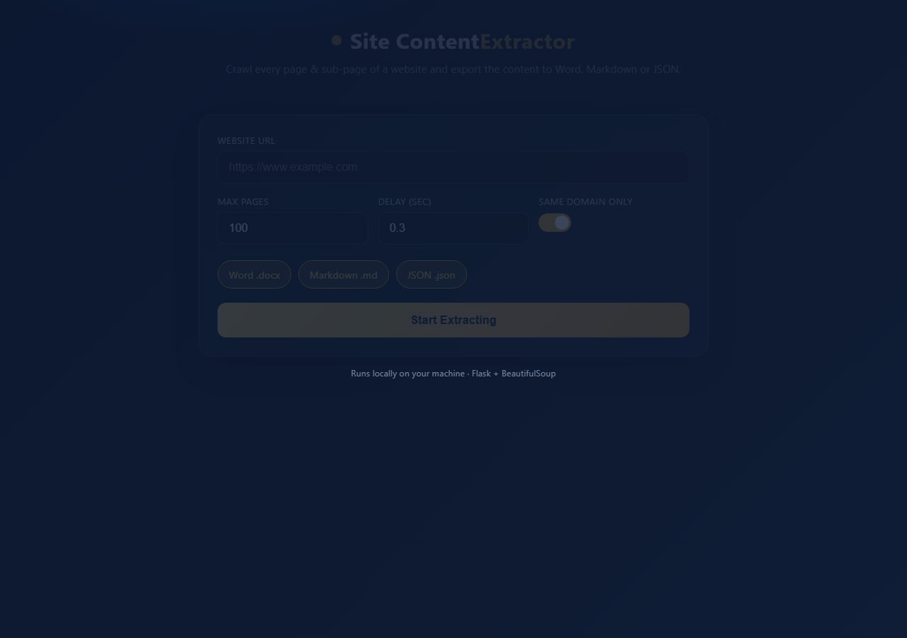

# Site Content Extractor

A local Flask web app that **crawls every page and sub-page of a website**,
strips the boilerplate (nav / header / footer / menus), and exports the clean
content to **Word (.docx)**, **Markdown (.md)**, and **JSON** — with a live
animated progress UI (per-page log, counters, word counts, download buttons).
Built for a translation office that needed to pull whole sites in for quoting
and translation.

## Screenshot



## Features

- **Full-site crawl** — follows internal links across pages and sub-pages.
- **Clean extraction** — removes nav/header/footer/menus, keeps the real content.
- **Three exports** — Word, Markdown, JSON.
- **Live progress** — pages discovered, crawled, and word counts as it runs.
- **Runs locally** — nothing is sent to a third-party service.

## Requirements

- Python 3.9+
- Packages in [`requirements.txt`](requirements.txt) — Flask, requests,
  beautifulsoup4, lxml, python-docx.

## Run

```bash
pip install -r requirements.txt
python app.py
```

Open **http://127.0.0.1:5005**, paste a URL, and start the crawl.

```bash
PORT=8000 python app.py        # macOS/Linux
$env:PORT=8000; python app.py  # Windows PowerShell
```

## How it works

| File | Role |
|------|------|
| `app.py` | Flask server + crawl orchestration and live progress stream. |
| `scraper.py` | Fetches pages, follows internal links, extracts clean content. |
| `builders.py` | Renders the collected content into DOCX / Markdown / JSON. |
| `static/`, `templates/` | The animated front end. |

## Please crawl responsibly

Only crawl sites you own or have permission to. Respect `robots.txt` and rate
limits.

## License

MIT
